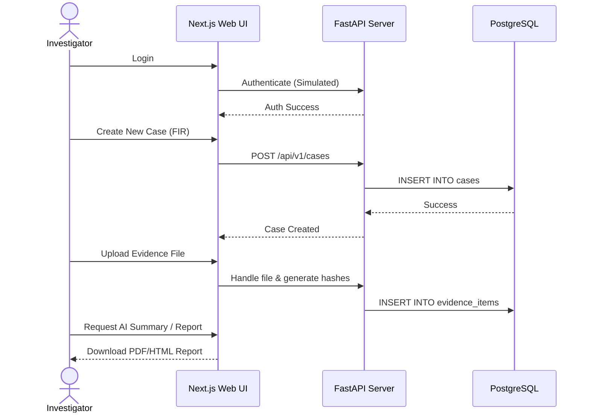

# 03 - Module Workflow

## End-to-End User Workflow

The CIIP platform allows a seamless flow from initial login to final report generation. The typical daily workflow for an investigator or analyst is as follows:

1. **Authentication:** The user logs in via the Next.js frontend portal.
2. **Dashboard Overview:** The user lands on the Dashboard view (`/dashboard`) to monitor active threats and cases.
3. **Case Management:** The user navigates to Cases (`/cases`) to register a new First Information Report (FIR) or open an existing case.
4. **Evidence Upload:** The user securely uploads files via the Evidence Vault (`/evidence`), where SHA-256 and MD5 hashes are simulated.
5. **Analysis Execution:** The user utilizes specific labs (e.g., `/osint` or `/ransomware`) to drill down into entities, IOCs, and network captures.
6. **Report Generation:** Findings are summarized and exported via the `ReportGenerator` utility.

## Workflow Diagram

