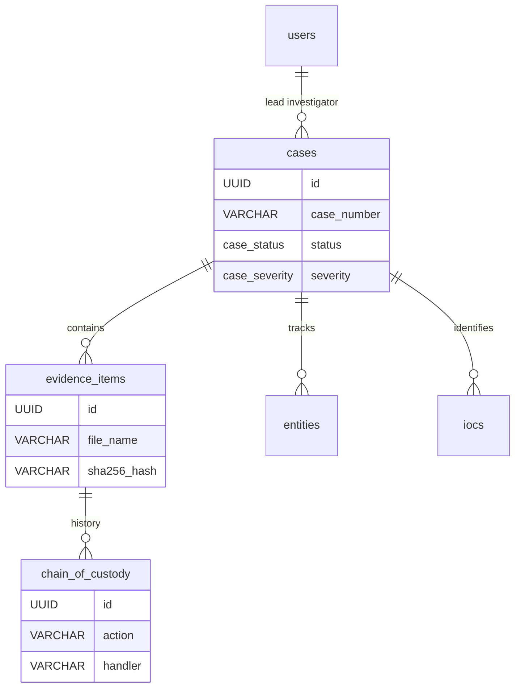

# 08 - Database Documentation

The CIIP database is built on PostgreSQL, utilizing standard relational features and `JSONB` for unstructured metadata. The schema is defined in `database/schema.sql` and `database/ransomware_migration.sql`.

## Primary Tables

### `users` and `roles`
* **Purpose:** Authentication, identity, and RBAC.
* **Key Columns:** `id` (UUID), `email`, `password_hash`, `badge_number`, `permissions` (JSONB).

### `cases`
* **Purpose:** The core entity linking all intelligence and evidence.
* **Key Columns:** `id`, `case_number`, `status` (Enum), `severity` (Enum), `case_type`, `lead_investigator` (FK).

### `evidence_items`
* **Purpose:** Stores metadata regarding acquired digital forensics artifacts.
* **Key Columns:** `evidence_number`, `case_id` (FK), `file_size`, `sha256_hash`, `status` (Enum).

### `chain_of_custody`
* **Purpose:** Immutable audit log of evidence handling.
* **Key Columns:** `evidence_id` (FK), `action`, `handler`, `from_location`, `to_location`, `digital_signature`.

### `entities` and `entity_relationships`
* **Purpose:** Graph-like nodes representing persons, IPs, domains, and the relationships between them.
* **Key Columns:** `entity_type` (Enum), `value`, `risk_score`. Relationships are linked via `source_entity_id` and `target_entity_id`.

### `iocs`
* **Purpose:** Indicators of Compromise linked to cases.
* **Key Columns:** `ioc_type`, `value`, `threat_level`.

### `ransomware_findings` (Migration)
* **Purpose:** Dedicated tracking for malware variants.
* **Key Columns:** `case_id` (FK), `family_name`, `variant`, `encryption_type`, `ransom_amount`.

## ER Diagram

