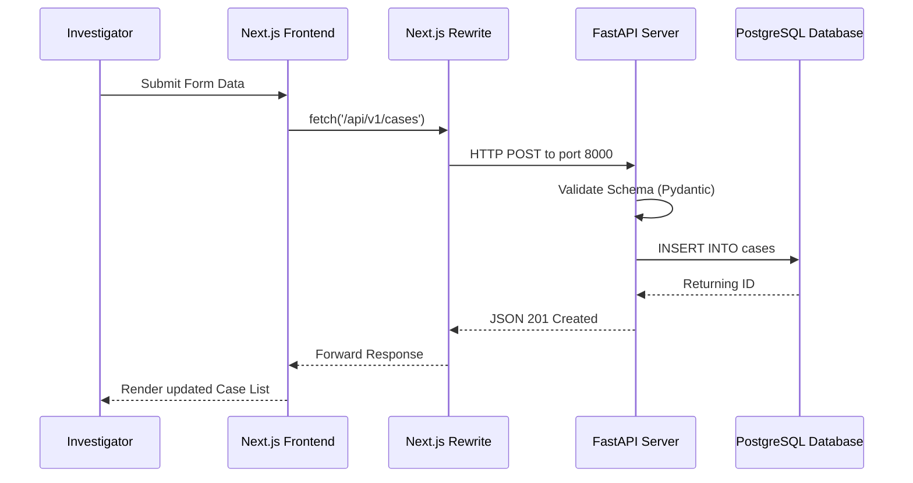

# 09 - Data Flow

The CIIP platform implements a modern, decoupled data flow where the frontend acts as the primary client interacting with the FastAPI backend over HTTP.

## Standard Data Flow

1. **User Input (Next.js):** The user interacts with the React UI (e.g., clicking "Register FIR" or uploading an evidence file).
2. **Client State (Zustand/React):** The frontend captures the input, updates local component state, and prepares the JSON payload or FormData.
3. **API Proxy (Next.js Node Server):** The Next.js frontend sends a `fetch` request to `/api/v1/...`. The `next.config.js` rewrites this path, proxying it to `http://localhost:8000/api/v1/...`.
4. **Backend Processing (FastAPI):** 
   - Receives the request.
   - Pydantic models (in `app/schemas`) validate the incoming data.
   - The appropriate router delegates the task to a service function.
5. **Database Interaction (PostgreSQL):** The service executes SQL queries (via SQLAlchemy or raw asyncpg, based on implementation) to read/write from the `cases`, `users`, or `evidence_items` tables.
6. **Response:** Data is serialized back to JSON and passed through the proxy back to the Next.js client, which re-renders the UI.

## Flow Diagram

