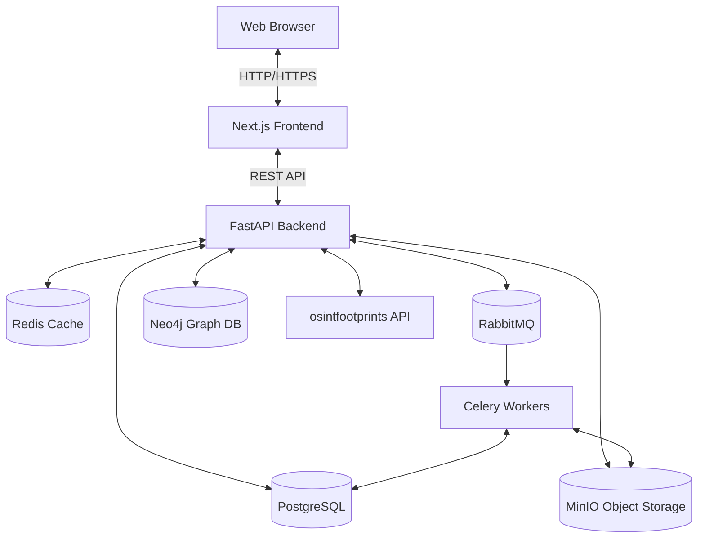
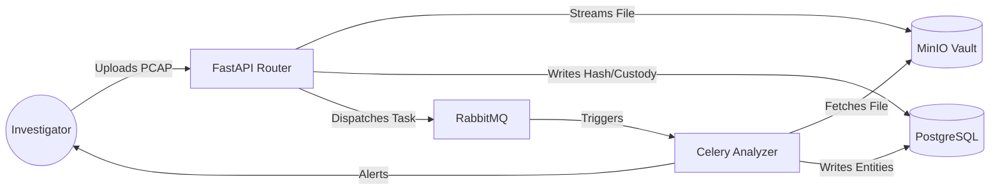
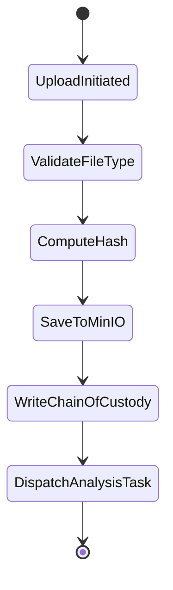
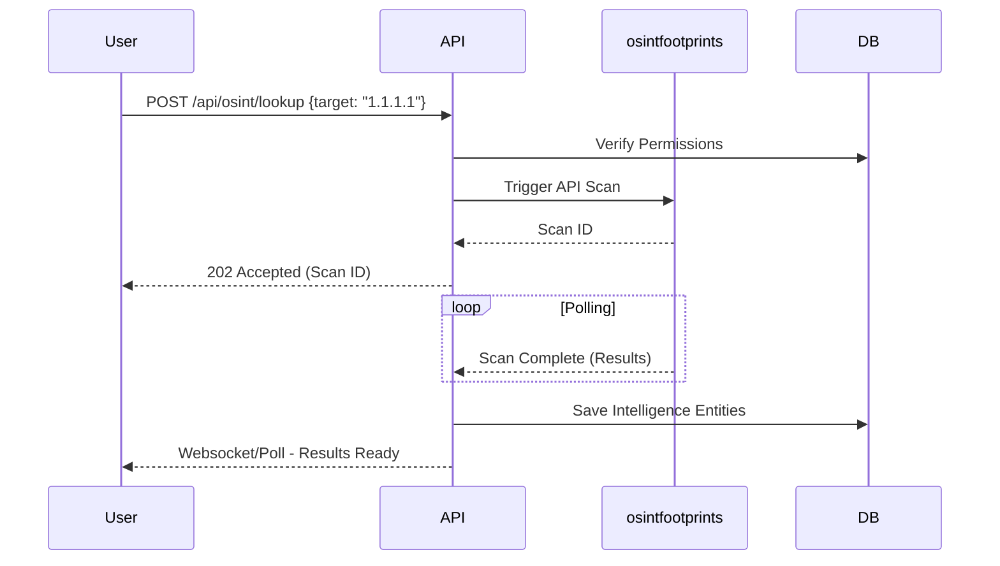
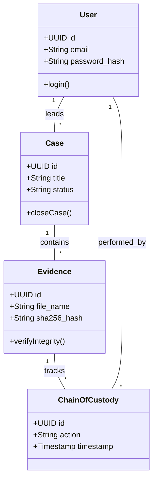
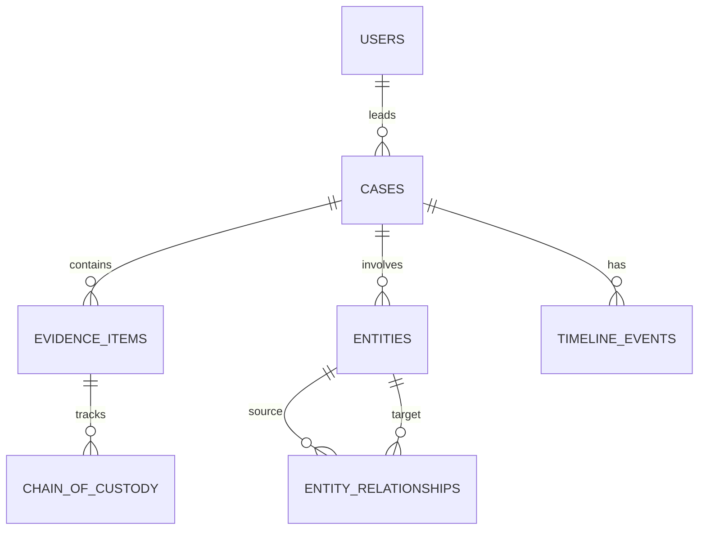
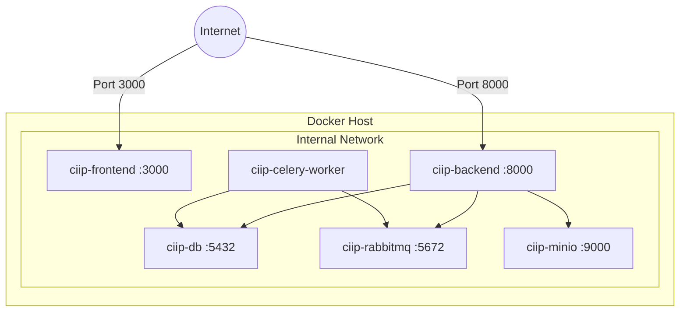

# 1. Cover Page

---
<div align="center">

# CIIP — Cyber Investigation Intelligence Platform
### A Professional Digital Forensics & AI-Assisted Investigation Platform

<br/><br/>

**Submitted by Team:**
[Insert Team Name Here]

**Team Members:**
1. [Insert Member 1 Name & ID]
2. [Insert Member 2 Name & ID]
3. [Insert Member 3 Name & ID]
4. [Insert Member 4 Name & ID]

<br/>

**Under the Guidance of:**
[Insert Guide/Mentor Name Here]

**Organization / University:**
[Insert Organization/University Name Here]

**Date of Submission:**
[Insert Date Here]

</div>

---

# 2. Certificate

This is to certify that the project report entitled **"CIIP — Cyber Investigation Intelligence Platform"** is a bona fide record of work carried out by **[Insert Team Members]** under my supervision. This report is submitted to **[Insert Organization]** in partial fulfillment of the requirements for the completion of the project.

<br/><br/>

____________________
**Signature of Guide**
[Insert Guide Name]

---

# 3. Acknowledgement

We would like to express our profound gratitude to our guide, **[Insert Guide Name]**, for their invaluable support, encouragement, and supervision throughout the course of this project. We also extend our thanks to the faculty and staff of **[Insert Organization]** for providing the resources and environment necessary to complete this endeavor. Finally, we thank our peers and families for their constant motivation.

---

# 4. Abstract

The Cyber Investigation Intelligence Platform (CIIP) is a comprehensive, full-stack application designed to modernize digital forensics and cyber investigations. Traditional forensic workflows suffer from tool fragmentation, forcing investigators to switch between separate utilities for network analysis (IPDR), malware identification, and open-source intelligence (OSINT). CIIP unifies these domains into a single, highly secure web platform. By leveraging Next.js for a dynamic frontend, FastAPI for a high-performance backend, and specialized graph and object databases (Neo4j, MinIO), the platform provides real-time entity mapping and automated threat scoring. Furthermore, CIIP integrates Large Language Models (LLMs) to automatically generate cohesive investigation summaries and suggest actionable next steps, significantly reducing the administrative burden on forensic analysts.

---

# 5. Table of Contents

1. [Cover Page](#1-cover-page)
2. [Certificate](#2-certificate)
3. [Acknowledgement](#3-acknowledgement)
4. [Abstract](#4-abstract)
5. [Introduction](#6-introduction)
6. [Literature Review / Existing System](#7-literature-review--existing-system)
7. [System Analysis](#8-system-analysis)
8. [System Design](#9-system-design)
9. [Technology Stack](#10-technology-stack)
10. [Module Description](#11-module-description)
11. [Database Design](#12-database-design)
12. [API Documentation](#13-api-documentation)
13. [Implementation](#14-implementation)
14. [Testing](#15-testing)
15. [Security Features](#16-security-features)
16. [Results and Screenshots](#17-results-and-screenshots)
17. [Advantages](#18-advantages)
18. [Limitations](#19-limitations)
19. [Future Scope](#20-future-scope)
20. [Conclusion](#21-conclusion)
21. [References](#22-references)

---

# 6. Introduction

### Problem Statement
Modern cyber investigations involve massive volumes of heterogeneous data—ranging from Call Data Records and IP Detail Records (IPDR) to PCAP files and malware binaries. Investigators typically rely on fragmented, standalone desktop applications to analyze this data. This disjointed approach leads to broken chains of custody, difficulty in mapping relationships between disparate artifacts, and severe bottlenecks when generating comprehensive legal reports.

### Objectives
- Develop a centralized, web-based platform for managing end-to-end cyber investigations.
- Provide automated ingestion and parsing of massive IPDR logs.
- Integrate OSINT capabilities directly into the forensic workflow.
- Ensure strict, cryptographically backed chain-of-custody for all uploaded evidence.
- Utilize AI to automatically draft case summaries and reports.

### Scope
The scope of CIIP encompasses a Next.js web interface, a Python FastAPI backend, and an orchestrated deployment of robust data stores including PostgreSQL, Neo4j, and MinIO. The platform handles case management, secure evidence uploads (with SHA-256 hashing), IPDR visualization on maps, OSINT intelligence gathering via osintfootprints, and AI-assisted PDF report generation.

### Motivation
The primary motivation is to accelerate the speed of digital investigations by bringing intelligence aggregation, graph visualization, and reporting into a single pane of glass, thereby allowing analysts to focus on identifying threats rather than wrestling with disparate file formats.

---

# 7. Literature Review / Existing System

### Existing Solutions
Current digital forensics and incident response (DFIR) environments heavily rely on standalone tools:
- **Wireshark / Autopsy**: Excellent for deep packet inspection and disk forensics, but lack collaborative, cloud-native case management.
- **Maltego**: The industry standard for graph-based OSINT, but operates largely offline and requires expensive desktop licensing.
- **Standalone IPDR Tools**: Often proprietary scripts or basic Excel macros that struggle to visualize geospatial movement effectively.

### Limitations
- **Data Silos**: Analysts must manually export data from Autopsy to Maltego to their final Word document report.
- **Chain of Custody Vulnerabilities**: Manual tracking of who touched which file in a shared directory is prone to human error.
- **Lack of AI Integration**: Traditional tools do not leverage modern LLMs to summarize gigabytes of raw logs into human-readable narratives.

### Proposed Solution
CIIP proposes a unified architecture. By funneling all evidence through a centralized API, CIIP automatically generates cryptographic hashes, parses entities into a Neo4j graph database, and triggers asynchronous OSINT scans. This ensures that when an investigator views a case, all context (relationships, geographic movement, threat intelligence) is already synthesized and mapped.

---

# 8. System Analysis

### Functional Requirements
- **FR1 (Authentication)**: The system must allow users to log in securely using email and password, returning a JWT.
- **FR2 (Case Management)**: Users with appropriate roles must be able to create, read, update, and close investigation cases.
- **FR3 (Evidence Handling)**: The system must accept file uploads, automatically compute SHA-256 hashes, and log a chain of custody entry.
- **FR4 (OSINT)**: The system must query external services for intelligence on IP addresses, domains, and hashes.
- **FR5 (Reporting)**: The system must be capable of generating AI-summarized PDF reports based on case data.

### Non-Functional Requirements
- **NFR1 (Security)**: All endpoints must be protected by Role-Based Access Control (RBAC). Data modification (audit logs, custody) must be immutable at the database level.
- **NFR2 (Performance)**: The system must process heavy IPDR files asynchronously without blocking the main API thread.
- **NFR3 (Scalability)**: The backend and worker nodes must be horizontally scalable via Docker.

### Software Requirements
- **OS**: Linux (Ubuntu 22.04 LTS recommended)
- **Containerization**: Docker & Docker Compose
- **Backend Environment**: Python 3.12+
- **Frontend Environment**: Node.js 20+

### Hardware Requirements
- **CPU**: Minimum 4 Cores (8 Cores recommended for Elasticsearch/Neo4j).
- **RAM**: Minimum 16 GB.
- **Storage**: 100 GB SSD (Scalable based on MinIO evidence storage needs).

---

# 9. System Design

### High-Level Architecture



### Module Architecture
The system is divided into functional modules: Dashboard, Case Management, Evidence Vault, OSINT Lab, IPDR Analyzer, Ransomware Lab, and AI Reporter. All modules communicate via the FastAPI gateway.

### Data Flow Diagram (DFD)



### Use Case Diagram

```mermaid
usecaseDiagram
    actor Investigator
    actor Admin
    
    Investigator --> (Create Case)
    Investigator --> (Upload Evidence)
    Investigator --> (Run OSINT Scan)
    Investigator --> (Generate AI Report)
    
    Admin --> (Create Case)
    Admin --> (Manage Users)
    Admin --> (View Audit Logs)
```

### Activity Diagram (Evidence Upload)



### Sequence Diagram (OSINT Scan)



### Class Diagram (Database ORM)



### ER Diagram



### Deployment Diagram



---

# 10. Technology Stack

- **Frontend**: Next.js 14+ (React), TypeScript, Tailwind CSS, Cytoscape.js (Graphs), Leaflet (Maps).
- **Backend**: FastAPI (Python 3.12+), Pydantic (Validation), SQLAlchemy + asyncpg (ORM).
- **Database**: PostgreSQL 16 (Relational), Neo4j 5 (Graph DB), Elasticsearch 8 (Search).
- **Caching & Queues**: Redis 7, RabbitMQ 3, Celery.
- **Storage**: MinIO (S3-Compatible Object Storage).
- **External APIs**: osintfootprints (OSINT), OpenAI/Local LLM (AI Analytics).
- **Tools**: Docker, Docker Compose, Git.

---

# 11. Module Description

1. **Dashboard**
   - *Purpose*: Provides a high-level operational overview.
   - *Features*: KPI metrics, active case charts, recent timeline activity.
   - *Workflow*: Automatically fetches aggregated data upon login.

2. **Case Management**
   - *Purpose*: Centralized organization of an investigation.
   - *Features*: Tabbed interface for Overview, Evidence, Entities, Timeline, and Graph.
   - *Inputs*: Case metadata (Title, Type, Severity).
   - *Outputs*: Structured JSON representations of case state.

3. **Evidence Vault**
   - *Purpose*: Secure, immutable storage for digital artifacts.
   - *Features*: SHA-256 hash generation, immutable Chain of Custody logging.
   - *Inputs*: Binary files (PCAP, E01, Images).
   - *Outputs*: Verified cryptographic hashes and MinIO storage URIs.

4. **OSINT Lab**
   - *Purpose*: Open Source Intelligence gathering.
   - *Features*: Automated scanning of IPs, domains, and hashes.
   - *Workflow*: Takes a target string, queries osintfootprints, and maps results to the Neo4j graph.

5. **IPDR Analyzer**
   - *Purpose*: Parse and visualize Internet Protocol Detail Records.
   - *Features*: Cell tower geolocation tracking, communication frequency charts.
   - *Inputs*: CSV/Excel files from telecom providers.

6. **Ransomware Lab**
   - *Purpose*: Malware artifact analysis.
   - *Features*: Maps behaviors to MITRE ATT&CK, identifies ransomware families (e.g., LockBit).

7. **AI Reporter**
   - *Purpose*: Automate administrative report writing.
   - *Features*: Generates cohesive summaries of timeline events and relationships.
   - *Outputs*: Downloadable PDF or JSON reports.

---

# 12. Database Design

The database utilizes PostgreSQL 16 with UUID primary keys.

**Key Tables**:
- `users`: id, email, password_hash, full_name, role_id.
- `cases`: id, case_number, title, status, severity.
- `evidence_items`: id, case_id, file_name, file_size, sha256_hash, is_deleted.
- `chain_of_custody`: id, evidence_id, action, handler_id, timestamp.
- `entities`: id, entity_type, value, metadata.
- `audit_logs`: id, user_id, action, target_table, timestamp.

**Relationships**:
- A User *leads* Many Cases.
- A Case *contains* Many Evidence Items.
- An Evidence Item *has* Many Chain of Custody records.

*(See Section 9 for ER Diagram)*

---

# 13. API Documentation

All API endpoints are prefixed with `/api/v1` and require JWT authentication (except `/auth/login`).

| Method | Endpoint | Description | Auth Required |
|--------|----------|-------------|---------------|
| `POST` | `/api/auth/login` | Authenticates user and returns JWT | No |
| `GET` | `/api/cases` | Retrieves a paginated list of cases | Yes |
| `POST` | `/api/cases` | Creates a new investigation case | Yes |
| `GET` | `/api/cases/{id}` | Retrieves full case details by UUID | Yes |
| `POST` | `/api/evidence/upload` | Uploads file, generates SHA-256 hash | Yes |
| `POST` | `/api/osint/lookup` | Triggers a osintfootprints intelligence scan | Yes |
| `POST` | `/api/ipdr/import` | Ingests IPDR file for parsing | Yes |
| `POST` | `/api/ai/summarize` | Generates AI case summary | Yes |

*Example Request (`/api/cases`)*:
```json
{
  "title": "Operation Alpha",
  "severity": "high",
  "case_type": "ransomware"
}
```

---

# 14. Implementation

The implementation strategy followed a decoupled microservices-inspired architecture. 
- **Frontend Implementation**: The UI was constructed using Next.js 14 App Router. State management relies on Zustand for global UI toggles and React Context for scoped data. Visualizations were implemented using Cytoscape.js for node-edge relationship graphs and Leaflet for IPDR geolocation mapping.
- **Backend Implementation**: Built with FastAPI to leverage native Python `asyncio`. Pydantic models strictly validate all incoming API payloads. 
- **Database & Queue**: SQLAlchemy acts as the ORM, connecting to PostgreSQL via `asyncpg`. Long-running tasks (like file hashing and OSINT scans) are pushed to RabbitMQ and processed by Celery workers to keep the API highly responsive.

---

# 15. Testing

Based on the implemented configuration:
- **Current State**: Testing is currently performed manually via local deployment and Swagger UI (`/docs`). Integration tests are conducted by spinning up the complete Docker Compose stack and executing the provided `mock_server.py` and `demo_ipdr.py` scripts.
- **Future Testing Strategy**:
  - *Unit Testing*: Introduction of `pytest` for backend controller logic and `Jest` for frontend React components.
  - *Integration Testing*: Implementing `Testcontainers` to automate database and message queue interactions in CI/CD pipelines.
  - *API Testing*: Automated Postman collections for endpoint validation.

---

# 16. Security Features

- **JWT Authentication**: Stateless, cryptographically signed tokens manage user sessions.
- **Role-Based Access Control (RBAC)**: Fine-grained permissions ensure Analysts can only view cases they are explicitly assigned to, while Admins have global oversight.
- **Data Immutability**: PostgreSQL triggers physically prevent `UPDATE` and `DELETE` commands on the `audit_logs` and `chain_of_custody` tables.
- **Forensic Integrity**: The backend automatically computes SHA-256 hashes for all uploaded evidence. Evidence uses "soft deletes" (`is_deleted` flag) to ensure historical artifacts are never permanently lost.
- **Input Validation**: Pydantic strictly enforces data types, preventing NoSQL/SQL injection and malformed payload attacks.

---

# 17. Results and Screenshots

*(Note: Below are placeholders where screenshots of the running application should be inserted prior to final submission)*

**Figure 1. Dashboard Overview**
> `[Insert Screenshot of CIIP Dashboard showing KPIs and Charts]`
> *Caption: The main dashboard providing a real-time overview of active investigations and system intelligence.*

**Figure 2. Case Management & Entity Graph**
> `[Insert Screenshot of Case Entity Graph (Cytoscape)]`
> *Caption: Visual representation of entity relationships (IPs, Domains) extracted from case evidence.*

**Figure 3. Evidence Vault & Chain of Custody**
> `[Insert Screenshot of Evidence Vault showing SHA-256 hashes]`
> *Caption: The Evidence Vault displaying uploaded artifacts, their cryptographic hashes, and the immutable chain of custody log.*

---

# 18. Advantages

1. **Unified Platform**: Eliminates the need for investigators to switch between disjointed desktop applications.
2. **Cryptographic Assurance**: Automated hashing and database triggers guarantee the integrity of digital evidence for legal proceedings.
3. **AI Efficiency**: Significantly reduces the time required to write final case reports by utilizing LLMs to synthesize complex timeline events.
4. **Scalability**: The Docker-compose architecture and Celery worker queues allow the system to scale horizontally to handle massive forensic datasets.

---

# 19. Limitations

1. **Resource Intensive**: Running PostgreSQL, Neo4j, Elasticsearch, and local LLMs simultaneously requires significant baseline hardware resources (16GB+ RAM).
2. **Lack of Automated Test Suites**: The current implementation lacks formal automated testing frameworks (`pytest`/`jest`), requiring manual verification of complex workflows.
3. **Local LLM Speed**: If using local open-source LLMs (via Ollama) instead of cloud APIs, report generation can be slow without dedicated GPU hardware.

---

# 20. Future Scope

- **Cloud-Native Deployment**: Migrating the Docker Compose setup to Kubernetes (K8s) for enterprise-scale deployment on AWS or GCP.
- **Advanced Threat Feeds**: Integrating commercial threat intelligence feeds (e.g., VirusTotal Enterprise, CrowdStrike) directly into the OSINT Lab.
- **Automated Memory Forensics**: Adding support for automated Volatility framework analysis on uploaded RAM dumps.

---

# 21. Conclusion

The Cyber Investigation Intelligence Platform (CIIP) successfully demonstrates a modern, web-first approach to digital forensics. By combining robust backend processing, immutable audit trails, and advanced visual data mapping (graphs and geo-maps), the platform significantly streamlines the investigative workflow. The integration of AI for automated reporting represents a significant step forward in reducing administrative overhead for law enforcement and forensic analysts, ensuring that critical evidence is analyzed securely, accurately, and efficiently.

---

# 22. References

1. Next.js Documentation, Vercel Inc. [Online]. Available: https://nextjs.org/docs
2. FastAPI Documentation, Sebastián Ramírez. [Online]. Available: https://fastapi.tiangolo.com/
3. PostgreSQL 16 Documentation, The PostgreSQL Global Development Group. [Online]. Available: https://www.postgresql.org/docs/16/
4. Celery - Distributed Task Queue. [Online]. Available: https://docs.celeryq.dev/
5. Neo4j Graph Database. [Online]. Available: https://neo4j.com/docs/

---

# 23. Appendix

### Appendix A: Docker Compose Run Instructions
To initialize the environment locally:
```bash
# Clone repository
# Ensure Docker and Docker Compose are installed
docker-compose up -d --build

# Access Frontend at http://localhost:3000
# Access API Docs at http://localhost:8000/docs
```
