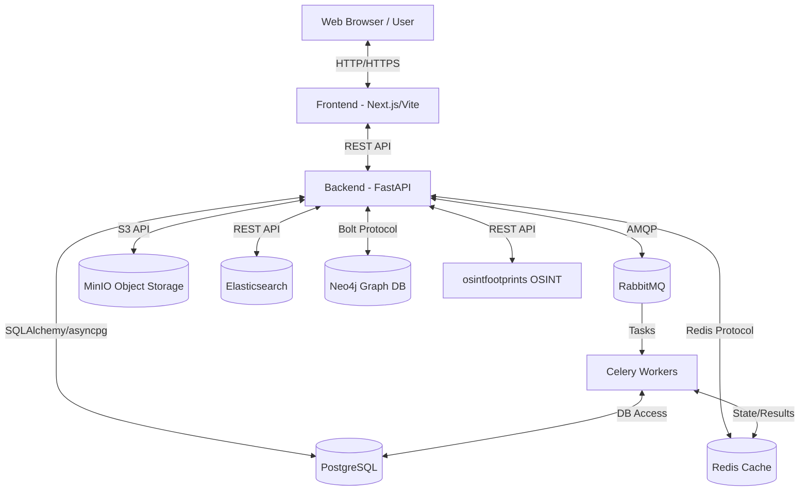
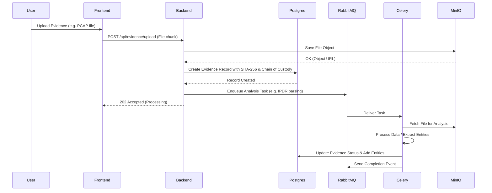
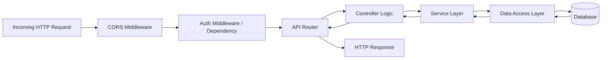
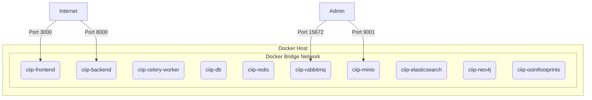

# System Architecture

## 1. High-Level Architecture

The CIIP platform is designed as a modern, decoupled web application featuring a frontend client, a backend API server, and a robust suite of data storage and processing services. 

## 2. Component Architecture

### Frontend Components (Port 3000 / 7860)
The codebase includes two separate frontend implementations:
- **Next.js 14 Frontend** (located in `/frontend`): Running on **Port 3000** locally (`start.bat`) or **Port 7860** in production/Hugging Face (`start.sh`). Written in TypeScript and styled with Tailwind CSS.
- **Vite React Frontend** (located in `/frontend-vite`): Running on **Port 3000** via Docker Compose (`docker-compose.yml`). Built with React 19, Vite 8, Tailwind CSS, and TypeScript.
- **Key UI Packages**: Uses shadcn/ui components, Cytoscape.js for entity relationship visualization, and Leaflet for geographical mapping.

### Backend Component (Port 8000)
- **Framework**: FastAPI
- **Language**: Python 3.12+
- **Purpose**: Handles all core business logic, API requests, authentication, and orchestrates interactions between data stores.

### Background Processing
- **Queue**: RabbitMQ (Port 5672)
- **Workers**: Celery
- **Purpose**: Handles asynchronous and long-running tasks such as OSINT lookups, data ingestion, and report generation without blocking the main API thread.

### Data Storage Layer
- **Relational DB**: PostgreSQL 16 (Port 5432) for structured data (Users, Cases, Evidences, Audit Logs).
- **Cache**: Redis 7 (Port 6379) for caching and Celery results.
- **Object Storage**: MinIO (Port 9000) for storing large evidence files and generated reports in an S3-compatible manner.
- **Search Engine**: Elasticsearch 8 (Port 9200) for full-text search capabilities across cases and evidence.
- **Graph DB**: Neo4j 5 (Port 7474/7687) for complex entity relationship mapping and traversal.

### Specialized Services
- **OSINT Lab**: osintfootprints (Port 5001) for performing open-source intelligence gathering.

## 3. Data Flow

## 4. Request/Response Flow

A typical API request follows a standard middleware pipeline in FastAPI:

## 5. Deployment Architecture

The application is deployed using Docker Compose, encapsulating all services within isolated containers on a single host machine or virtual machine.

### Key Deployment Characteristics:
- All services communicate via a shared internal Docker network.
- Environment variables are heavily utilized to inject configuration (e.g., `DATABASE_URL`, `MINIO_ACCESS_KEY`).
- Volumes are mapped for persistent storage for all stateful services (Postgres, Redis, MinIO, etc.) to ensure data survives container restarts.
