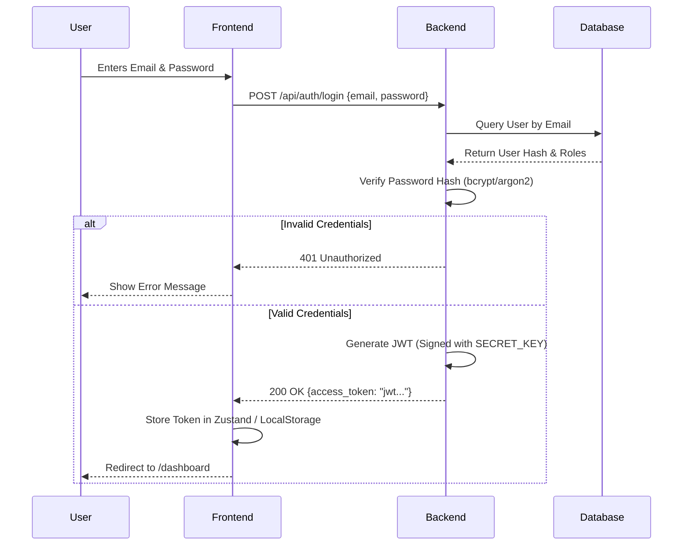

# Authentication & Authorization

The CIIP platform implements a robust, secure authentication and authorization layer designed for sensitive investigative environments.

## 1. Authentication Method

The system exclusively uses **JSON Web Tokens (JWT)** for stateless, scalable authentication.

### Login Flow

1. **Submission**: Users submit credentials via the frontend login page.
2. **Verification**: The backend uses secure hashing algorithms (likely `bcrypt` or `argon2` via `passlib`) to verify passwords.
3. **Token Issuance**: A short-lived JWT is issued. It contains the user's `id` as the subject (`sub`) and embedded role information.
4. **Token Usage**: The frontend includes this token in the `Authorization: Bearer <token>` header for all subsequent API requests.

## 2. User Roles

The system employs a strict Role-Based Access Control (RBAC) model. The predefined roles in the system are:

- **Admin**: Full system access, user management, system configuration, and visibility into all audit logs.
- **Supervisor**: Can oversee multiple cases, assign investigators, and review case closures.
- **Investigator**: Can create cases, upload evidence, run analyses, and manage their assigned cases.
- **Analyst**: Read/Write access limited specifically to the cases they are assigned to.

### Default System Accounts (for testing/initialization)
| Role          | Email                       | Password         |
|---------------|-----------------------------|-------------------|
| Admin         | sarah.chen@ciip.gov         | CiipSecure2026!  |
| Investigator  | marcus.wright@ciip.gov      | CiipSecure2026!  |
| Analyst       | aisha.patel@ciip.gov        | CiipSecure2026!  |
| Supervisor    | james.holloway@ciip.gov     | CiipSecure2026!  |

## 3. Permission System

Authorization is enforced at multiple layers:

### Database Layer
The `roles` table contains a `permissions` JSONB column. This allows for fine-grained, highly customizable permission definitions beyond simple static roles (e.g., `["cases:read", "cases:write", "evidence:delete"]`).

### API Layer
FastAPI dependencies are used to protect routes:
- `get_current_user`: Ensures the JWT is valid and the user exists.
- `get_current_active_user`: Ensures the user account is not disabled.
- Custom dependencies (e.g., `require_role(["Admin", "Supervisor"])`) can inspect the user's roles from the database or the JWT payload to block unauthorized access at the controller level.

### Case-Level Access
In addition to global roles, access to specific case data is restricted via the `case_assignments` table. An `Analyst` cannot read a case they are not explicitly assigned to, even if they have global `cases:read` permissions. This ensures strict compartmentation of sensitive investigations.
