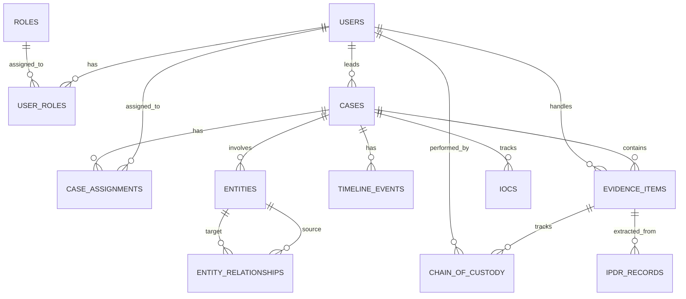

# Database Documentation

## 1. Database Type

The CIIP platform utilizes **PostgreSQL 16** as its primary relational database management system. It is chosen for its robust support for JSONB (crucial for storing flexible metadata and AI reports), ACID compliance, and advanced indexing capabilities. 
The schema makes heavy use of UUIDs for primary keys to ensure global uniqueness and prevent enumeration attacks.

## 2. Core Tables

The schema is divided into 16 primary tables logically grouped by domain:

### Users & Access Control
- **`users`**: Stores user accounts, email, hashed passwords, full names, and badge numbers.
- **`roles`**: Defines RBAC roles (Admin, Investigator, Analyst, Supervisor) and associated JSON permissions.
- **`user_roles`**: Junction table mapping users to their roles.

### Case Management
- **`cases`**: Central entity representing an investigation. Contains status, severity, tags, and metadata.
- **`case_assignments`**: Maps users to cases with specific roles (e.g., lead investigator, analyst).
- **`timeline_events`**: Chronological log of significant events within a case (e.g., evidence added, entity discovered).

### Evidence & Forensics
- **`evidence_items`**: Records of uploaded files, tracking SHA-256 hashes, file types, sizes, and validation status. Note: Implements soft deletion (`is_deleted`) to preserve forensic integrity.
- **`chain_of_custody`**: Immutable ledger tracking every action, handler, and location change for an evidence item, including digital signatures.

### Intelligence & Entities
- **`entities`**: Represents extracted or discovered artifacts (e.g., IP addresses, domains, emails, people, organizations).
- **`entity_relationships`**: Junction table defining how entities relate to one another (e.g., "COMMUNICATED_WITH", "RESOLVES_TO").
- **`iocs`**: Indicators of Compromise (hashes, domains, IPs) associated with cases.
- **`ipdr_records`**: Parsed communication records (source IP, dest IP, ports, timestamps, byte counts).
- **`osint_results`**: Stored intelligence gathered from osintfootprints scans.
- **`ransomware_findings`**: Specific attributes relating to ransomware families, kill chains, and decryptor availability.

### System & AI
- **`ai_reports`**: Stores generated case summaries and analysis suggestions from the AI engine.
- **`audit_logs`**: System-wide immutable logging for security and compliance tracking. Database triggers prevent modification of these records.

## 3. Relationships and ER Diagram

## 4. Security Mechanisms

- **UUIDv4**: Used for all primary keys to obscure sequential data creation.
- **Triggers**: The database utilizes triggers on `audit_logs` and `chain_of_custody` to reject `UPDATE` and `DELETE` statements, ensuring true immutability at the database engine level.
- **Soft Deletes**: `evidence_items` utilizes an `is_deleted` boolean rather than physical deletion to ensure historical records are never lost.
