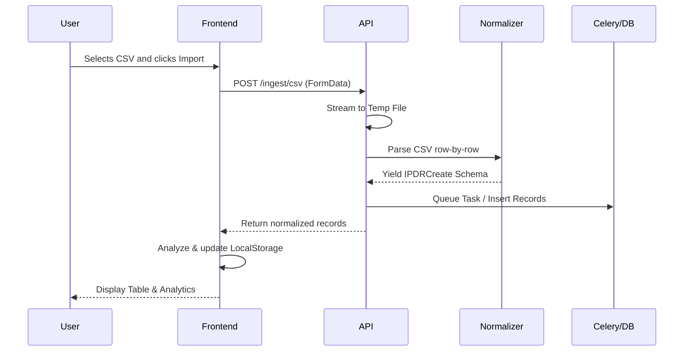

# IPDR Analyzer Module Documentation

## 1. Module Overview
The **IPDR (IP Detail Record) / CDR (Call Data Record) Analyzer** is a core forensics module within the Aegis Digital Forensics Platform. It is designed to process, normalize, analyze, and visualize communication records. By parsing large CSV files from various ISPs and telecom operators, it allows investigators to identify suspicious communication patterns, late-night calls, frequent cell tower changes, and communication frequencies.

## 2. Module Architecture
The module follows a modern decoupled architecture:
*   **Frontend (Next.js/React):** Provides an interactive interface (`/ipdr`) utilizing `@tanstack/react-virtual` for efficient rendering of large datasets, dynamic searching, and client-side pattern analysis. It leverages browser `localStorage` for state persistence.
*   **Backend (FastAPI):** Exposes REST APIs for ingestion and analytics. It handles streaming large file uploads and dispatches data to normalization services.
*   **Background Processing (Celery):** Contains a task worker (`process_ipdr_file`) capable of parsing large CSV files asynchronously in the background.
*   **Database (PostgreSQL / SQLAlchemy):** Uses a canonical schema (`IPDRRecord`) to persist structured data uniformly, regardless of the original ISP format.


## 3. Module Workflow
1.  **Data Upload:** The investigator uploads a CSV file through the UI.
2.  **Streaming & Normalization:** The file is streamed to the backend in chunks (to prevent OOM errors). The backend reads the file line by line and passes each row to the `IPDRNormalizer`.
3.  **Data Mapping:** The normalizer maps heterogeneous column names (e.g., `src_ip`, `calling_party`) to canonical fields (e.g., `source_identifier`).
4.  **Ingestion:** Parsed records are stored in the PostgreSQL database. *(Note: While a Celery task exists for bulk ingestion, the API currently processes and returns the parsed records synchronously for immediate UI feedback.)*
5.  **Client-side Analysis:** The frontend receives the parsed records (or loads them from `localStorage`), computes statistical insights (top contacts, cell movements, risk patterns), and renders the views.
6.  **Export:** Investigators can export a summarized `.txt` report directly from the UI.

## 4. Folder Structure
The IPDR module's codebase is distributed across the frontend and backend architectures:

**Backend:**
```text
backend/app/
 ├── api/v1/endpoints/ipdr.py      # REST API routes
 ├── models/ipdr.py                # SQLAlchemy database model
 ├── schemas/ipdr.py               # Pydantic validation schemas
 ├── services/ipdr_normalizer.py   # Normalization logic for diverse CSVs
 └── workers/ipdr_tasks.py         # Celery background tasks
```

**Frontend:**
```text
frontend/src/
 ├── app/(dashboard)/ipdr/page.tsx # Main UI Page
 └── components/layout/Sidebar.tsx # Navigation integration
```

## 5. Features
*   **CSV File Ingestion:** Supports ingestion of diverse IPDR/CDR files with automatic column mapping.
*   **Tabular View:** Uses row virtualization to efficiently display thousands of records in a table format.
*   **Pattern Analysis:** Client-side heuristics that detect suspicious behavior such as late-night calls, calls exceeding 30 minutes, and rapid cell tower hopping.
*   **Summary Statistics:** Dashboard cards displaying Total Records, Unique Numbers, Total Duration, and Late Night Calls.
*   **Local State Persistence:** Uses `localStorage` to cache records so investigators don't lose data on page refresh.
*   **Advanced Analytics APIs:** Backend endpoints capable of graphing connection nodes and detecting impossible travel anomalies (prepared for future UI integration).

## 6. User Interface Documentation
The IPDR page (`/ipdr`) is split into several interactive sections:
*   **Header Controls:** 
    *   `Import Data`: Opens file dialog restricted to `.csv`.
    *   `Export`: Downloads a generated `.txt` summary report.
    *   `Remove All`: Clears the local storage cache and state.
*   **View Toggles:** Switches between "Records Table" and "Pattern Analysis".
*   **Global Search:** Filters records dynamically across `source_identifier` and `destination_identifier`.
*   **Records Table View:** Displays columns for Source, Destination, Type (Voice/SMS/Data), Start Time, Duration, Cell ID, Location, and IMEI. Individual records can be deleted.
*   **Pattern Analysis View:** 
    *   *Suspicious Patterns Detected:* Highlights high/medium risk behavior based on rules.
    *   *Communication Frequency:* Bar chart representing the most frequently contacted numbers.
    *   *Recent Cell Tower Movement:* A visual path of the most recent tower hops.

## 7. Backend Documentation
### Normalizer (`IPDRNormalizer`)
Located in `app/services/ipdr_normalizer.py`. Normalizes raw dict rows using predefined `FIELD_MAPPINGS` to map various telecom naming conventions into the `IPDRCreate` Pydantic schema. Parses multiple date string formats into standard ISO datetimes.

### Endpoints (`app/api/v1/endpoints/ipdr.py`)
*   `POST /api/v1/ipdr/ingest/json`: Ingests a raw list of JSON records directly into the DB.
*   `POST /api/v1/ipdr/ingest/csv`: Streams a multipart file upload to a temporary file, normalizes the CSV, and returns up to 1000 parsed records to the frontend.
*   `GET /api/v1/ipdr/status/{task_id}`: Polls the status of the Celery ingestion task.
*   `GET /api/v1/ipdr/analytics/graph`: Returns `nodes` and `links` to power force-directed graph visualizations by grouping source/destination pairs.
*   `GET /api/v1/ipdr/analytics/anomalies`: Uses `AnomalyDetector.detect_impossible_travel()` on recent records with valid coordinates.

## 8. Database Documentation
The canonical database model is defined in `backend/app/models/ipdr.py`.

**Table:** `ipdr_records`
| Column | Type | Description |
| :--- | :--- | :--- |
| `id` | UUID (PK) | Primary Key |
| `case_id` | UUID (FK) | Links the record to a specific investigation case |
| `timestamp` | DateTime | Start time of the communication (Indexed) |
| `source_identifier` | String | Source IP, Phone number, or MAC (Indexed) |
| `destination_identifier`| String | Destination IP, Phone number, or MAC (Indexed)|
| `protocol_type` | String | e.g., Voice, SMS, Data |
| `duration_seconds` | Integer | Length of the call or session |
| `cell_id` | String | Cell Tower Identifier (Indexed) |
| `location_lat` | Float | Latitude of the tower |
| `location_lon` | Float | Longitude of the tower |
| `bytes_up` | BigInteger | Upload usage |
| `bytes_down` | BigInteger | Download usage |
| `imei` | String | Device IMEI (Indexed & Luhn Validated) |
| `imsi` | String | SIM IMSI (Indexed) |

## 9. Data Flow



## 10. Security
*   **Authentication:** All backend endpoints are secured by the `get_current_user` FastAPI dependency.
*   **Data Validation:** Pydantic validators in `schemas/ipdr.py` enforce boundaries (e.g., lat/lon checks) and perform structural checks, including Luhn algorithm checksums for IMEIs. Invalid IMEIs are preserved but cleaned of non-numeric characters for forensic integrity.
*   **Memory Management:** The CSV upload endpoint streams the payload in 1MB chunks to disk (`aiofiles.open`) rather than loading it entirely into RAM, mitigating DoS via large file payloads.

## 11. Report Generation
The frontend includes an `exportReport` function that builds a plaintext summary (`.txt`) locally via Blob APIs. The generated report includes:
*   Timestamp of generation.
*   Overview Statistics (Total Records, Unique Numbers, Duration).
*   Suspicious Patterns explicitly detailed.
*   Top Contacts list.
*   Recent Cell Tower Movements chain.

## 12. Integration with Main Project
The IPDR Analyzer is seamlessly integrated into the primary Aegis interface.
*   It is accessible via the main `Sidebar.tsx` navigation menu.
*   It shares the global `globals.css` and `layout.tsx` styling components (e.g., `cyber-card-flat`, `cyber-badge`).
*   It utilizes the centralized backend database session dependency (`get_db`) and authentication.

## 13. Installation & Configuration
No special installation is required outside the primary project setup. However, for background processing of massive datasets:
1.  Ensure Redis is running (used as the Celery broker).
2.  Start the Celery worker from the backend directory:
    ```bash
    celery -A app.core.celery_app worker --loglevel=info
    ```
*(Note: As of the current codebase, Celery dispatch in the API is commented out to prevent blocking when Redis is unavailable, operating in a local-sync mode instead.)*

## 14. Testing
Unit testing can be performed using pytest on the backend schema validators (`luhn_checksum`) and the `IPDRNormalizer`. End-to-end testing must verify the CSV streaming logic and the client-side `localStorage` caching mechanics. Currently, explicit test files for IPDR were not identified in the `tests/` directory.

## 15. Future Enhancements
Based on the current implementation state, the following improvements are recommended:
1.  **Re-enable Celery:** Uncomment the `process_ipdr_file.delay()` call in `endpoints/ipdr.py` to offload massive CSV files completely, relying on the `task_id` polling endpoint instead of synchronous parsing.
2.  **Graph UI Integration:** Develop a frontend visualization (e.g., using `react-force-graph`) to consume the existing backend `GET /analytics/graph` endpoint.
3.  **Anomaly UI Integration:** Display the output of `GET /analytics/anomalies` (Impossible Travel detections) directly in the Pattern Analysis view.

## 16. Conclusion
The IPDR module is a robust and flexible component of the Aegis platform. Its ability to normalize varied data formats into a canonical schema and instantly surface suspicious communication patterns on the client side provides immediate value for digital forensic analysts and law enforcement personnel.
