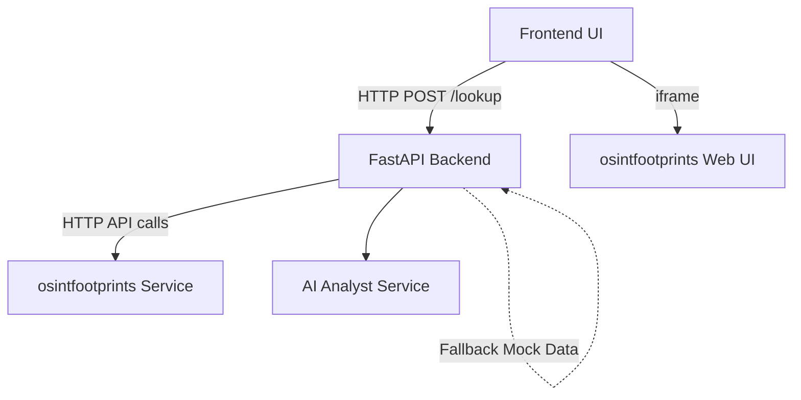

# OSINT Lab Module Documentation

## 1. Module Overview
The OSINT (Open Source Intelligence) Lab module is designed to provide automated and interactive open-source threat intelligence capabilities within the CIIP platform. It allows analysts to investigate Indicators of Compromise (IOCs) such as IPs, domains, hashes, and emails to uncover associated malicious infrastructure, geographical data, threat intelligence hits, and vulnerabilities. The module primarily acts as an integration wrapper around a local instance of the `osintfootprints` engine.

## 2. Module Architecture
The OSINT module follows a client-server architecture with an external dependency on `osintfootprints`:
- **Frontend UI (`Next.js`)**: Provides an interactive dashboard embedding the `osintfootprints` UI via an iframe, alongside a custom Target Report generation modal for quick executive summaries.
- **Backend API (`FastAPI`)**: Exposes an endpoint (`/api/v1/osint/lookup`) to trigger scans programmatically, poll for results, and format them for consumption.
- **OSINT Engine (`osintfootprints`)**: A third-party service hosted locally (typically port 5001) that handles the actual intelligence gathering by running various passive modules (e.g., DNS, WHOIS, AbuseCH).
- **AI Analyst Integration**: The backend service utilizes an AI component (`app.services.ai_analyst`) to generate a natural language summary of the OSINT findings.



## 3. Module Workflow
1. **Interactive Usage**: Users access the OSINT Lab through the frontend dashboard. They can either interact directly with the embedded `osintfootprints` UI or use the top search bar to "Generate Target Report" for a specific IOC.
2. **Programmatic / Lookup Workflow**: 
   - A request containing an IOC is sent to the backend `/lookup` endpoint.
   - The backend service sends a request to the `osintfootprints` `/startscan` API using fast passive modules.
   - The backend polls `/scanstatus` until the scan finishes or errors out (up to 15 seconds).
   - Results are fetched via `/scanexportjsonmulti`.
   - The data is parsed to determine reputation, confidence score, and relevant enrichment tags.
   - The `ai_analyst` generates a summary.
   - If the `osintfootprints` engine is unreachable or fails, the backend falls back to generating mocked data.

## 4. Folder Structure
The implementation of the OSINT module spans across the frontend and backend workspaces:

```text
ciip
├── backend/
│   └── app/
│       ├── api/v1/endpoints/
│       │   └── osint.py         # FastAPI router and endpoints
│       ├── schemas/
│       │   └── osint.py         # Pydantic models for request/response
│       └── services/
│           └── osint.py         # Core business logic and osintfootprints integration
├── frontend/
│   └── src/app/(dashboard)/
│       └── osint/
│           └── page.tsx         # Next.js UI implementation
└── osintfootprints/             # Core OSINT engine directory
```

## 5. Features
- **Embedded OSINT UI**: Direct access to the `osintfootprints` UI through an iframe without leaving the platform.
- **Target Report Generation**: Instant display of simulated executive summaries for an entered IOC, with logic distinguishing between target types (Email, Hash, IP/Domain).
- **Programmatic IOC Enrichment**: A backend API for passive background scans and enrichment.
- **AI Summarization**: Automatic generation of an AI summary for the scan results.
- **Fallback Mechanism**: Reliable backend execution that gracefully degrades to mocked data if the external engine is unavailable.
- **Report Export**: Capability to download the generated OSINT target report as an HTML file.

## 6. User Interface Documentation
**Path**: `frontend/src/app/(dashboard)/osint/page.tsx`

The UI consists of three primary components:
1. **Header Bar**: 
   - Displays the title "Osint Lab".
   - Contains a search input field (`Enter IP, Domain, or Hash...`) and a "Generate Target Report" button.
   - Automatically populates the target input if the `target` URL query parameter is present.
2. **Embedded Iframe**: 
   - Embeds `http://localhost:5001`, providing direct access to the `osintfootprints` interface.
3. **Target Report Modal**:
   - Triggers when the user submits a target.
   - Displays an Executive Summary (Risk level, total findings, vulnerabilities, ports).
   - Shows detailed panels for Associated Infrastructure, Threat Intelligence, Geographic Info / Domain Intel / File Intel (depending on the target type).
   - Discovers Vulnerabilities (mocked CVEs) and Exposed Ports.
   - **Note**: The data shown in the modal is currently generated via frontend logic (mocked based on whether the input is an email, hash, or IP/domain).
   - Contains an "Export PDF" button which actually downloads an HTML format report.

## 7. Backend Documentation
**API Endpoint (`backend/app/api/v1/endpoints/osint.py`)**
- **POST `/api/v1/osint/lookup`**: Accepts an `OSINTRequest` and returns an `OSINTResponse`.

**Schemas (`backend/app/schemas/osint.py`)**
- `OSINTRequest`: Requires `ioc` (string) and `ioc_type` (string: ip, domain, hash, email).
- `OSINTResponse`: Returns `ioc`, `ioc_type`, `reputation` (benign, malicious, suspicious, unknown), `confidence_score` (float), `tags` (list of strings), `enrichment_data` (dict), and an optional `ai_summary`.

**Service (`backend/app/services/osint.py`)**
- `OSINTService.enrich`: 
  - Hits `osintfootprints` at the host defined by `osintfootprints_HOST` environment variable (defaults to `localhost:5001`).
  - Initiates a scan with `modulelist="sfp_dns,sfp_whois,sfp_abusech"` and `usecase="passive"`.
  - Polls for completion up to 15 times (1 second intervals).
  - Parses JSON results looking for "MALICIOUS", "BLACKLIST", "DNS", or "WHOIS" event types.
  - Automatically flags tags as "malicious" or "safe" and adjusts the confidence score.
  - Calls `ai_analyst.generate_osint_summary` for final enrichment.
  - On exception (timeout/error), uses a randomized fallback mocked response.

## 8. Database Documentation
Currently, the OSINT module **does not interact with any internal relational database**. 
- It operates completely statelessly in the backend, relying on external services (`osintfootprints`) for storage or retrieving real-time data on the fly.
- Results from the `/lookup` API are returned to the caller but not persisted in local tables (unless integrated into a parent `Case` or `Evidence` model, which is outside the pure OSINT module scope).

## 9. Data Flow
1. **Lookup Initiation**: The client sends an IOC to `/api/v1/osint/lookup`.
2. **Scan Trigger**: `osint_service` executes an HTTP POST to `http://<osintfootprints_HOST>:5001/startscan`.
3. **Execution & Polling**: The backend loops HTTP GET requests to `/scanstatus` to monitor progress.
4. **Data Retrieval**: Upon completion, the backend calls `/scanexportjsonmulti` to fetch raw results.
5. **Data Transformation**: The service maps the raw `osintfootprints` event types into a structured `OSINTResponse` schema (tags, confidence, reputation).
6. **AI Enrichment**: The structured dictionary is passed to `ai_analyst` for summary generation.
7. **Delivery**: The finalized JSON response is sent back to the API caller.

## 10. Security
- **Passive Scanning**: The backend integration specifically enforces a `passive` usecase. This ensures that lookups do not directly interact with or alert malicious infrastructure, maintaining OPSEC.
- **Target Neutrality**: The frontend iframe is embedded without sandbox restrictions to allow `osintfootprints` full functionality; this requires trusting the local `osintfootprints` instance.
- **Sanitization**: Report HTML generation in the frontend relies on Javascript string interpolation and `URL.createObjectURL`. It is functional but relies on simple DOM creation. 

## 11. Report Generation
**Frontend Implementation**:
- The UI modal generates a downloadable report on the fly when the user clicks "Export PDF" (note: it actually exports an HTML file, not PDF).
- **Structure**: The exported HTML contains an Executive Summary, Discovered Vulnerabilities, Exposed Ports & Services, and Geolocation & Infrastructure Details.
- **Mechanism**: It constructs an HTML string dynamically based on the target type (email vs. hash vs. domain/IP), converts it into a `Blob`, creates an object URL, and triggers an anchor tag download (`OSINT_Report_<Target>_<Timestamp>.html`).

## 12. Integration with Main Project
- **Dashboard URL Parameter**: The OSINT UI listens for the `?target=` query parameter. If another module (e.g., Timeline or IPDR) routes a user to `/osint?target=1.1.1.1`, the page automatically fills the input and immediately displays the Target Report modal.
- **AI Analyst**: Relies on `app.services.ai_analyst` for LLM-based summarization of the retrieved intelligence.

## 13. Installation & Configuration
- **Dependencies**: Requires `httpx` in the backend for async HTTP calls.
- **Environment Variables**:
  - `osintfootprints_HOST`: Must point to the host where the OSINT engine is running (default: `localhost`).
- **Prerequisites**: The `osintfootprints` server must be running and accessible at port 5001.

## 14. Testing
- The backend features a built-in fallback mock mechanism. If `osintfootprints` is not running during testing, the backend will catch the exception and return a simulated `OSINTResponse` (with random malicious/benign flags) so the application does not crash.
- No dedicated unit test files for `osint.py` were found in the `backend/tests` or `frontend/tests` scope.

## 15. Future Enhancements
- **Frontend Real-Data Integration**: Update the frontend `OSINTContent` modal to fetch real data from the backend `/api/v1/osint/lookup` endpoint instead of relying entirely on mocked presentation data.
- **Database Persistence**: Save OSINT lookup results to a database table to build an internal IOC history and avoid redundant scans.
- **True PDF Export**: Integrate a library like `jspdf` or `puppeteer` to export actual PDF documents instead of HTML blobs.
- **Authentication**: Add JWT token or session validation on the OSINT FastAPI endpoint.

## 16. Conclusion
The OSINT Lab module provides a vital threat intelligence capability for the CIIP platform. By embedding the `osintfootprints` engine into the UI and creating an asynchronous API wrapper in the backend, it serves as both an interactive investigation hub and a programmatic enrichment service. While the backend possesses functional integration with the external OSINT engine, the frontend presentation currently utilizes simulated data for demonstration purposes, outlining a clear path for future alignment.
