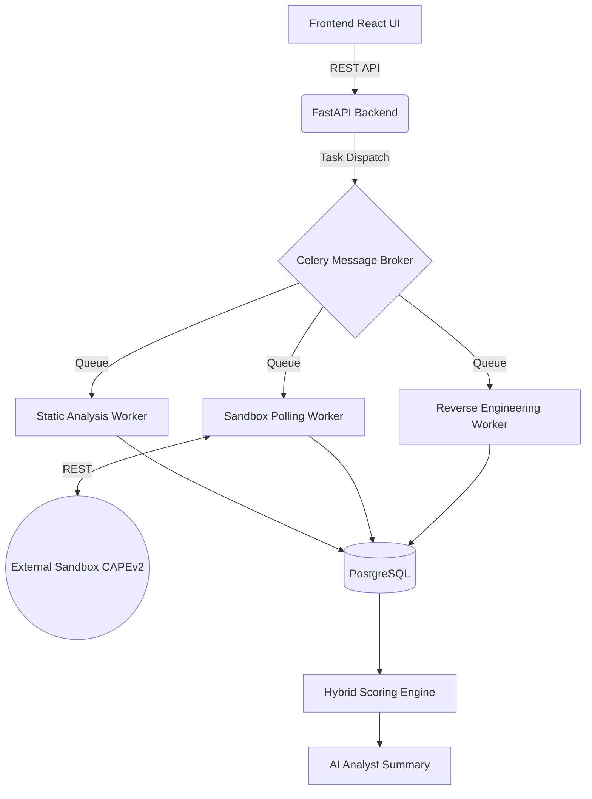
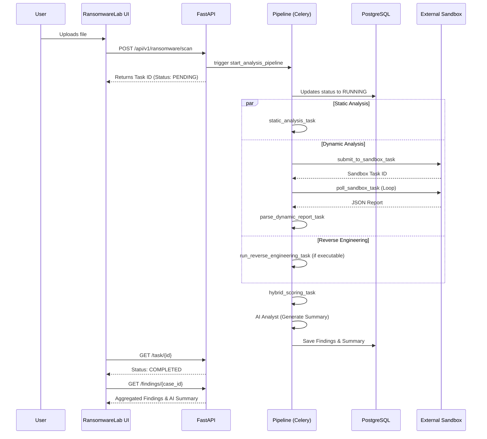

# Ransomware Lab Module Documentation

## 1. Module Overview
The Ransomware Lab is a sub-module of the Cyber Investigation Intelligence Platform (CIIP). It provides an end-to-end, AI-driven malware and ransomware analysis pipeline. The module allows analysts to upload suspicious samples, which are then processed through static analysis, dynamic external sandboxing, and reverse engineering, culminating in a hybrid threat score and an AI-generated executive summary.

## 2. Module Architecture
The module strictly follows a 4-tier architecture, implemented via FastAPI, Celery, and PostgreSQL.



## 3. Module Workflow



## 4. Folder Structure
The implementation spans across the backend, frontend, and database layers:

```text
ciip/
├── backend/
│   ├── app/
│   │   ├── api/v1/endpoints/
│   │   │   └── ransomware.py
│   │   ├── core/
│   │   │   ├── schema_models.py
│   │   │   └── scoring.py
│   │   ├── services/
│   │   │   ├── ai_analyst.py
│   │   │   ├── behavior_analytics.py
│   │   │   ├── pipeline.py
│   │   │   ├── reverse_engineering.py
│   │   │   ├── sandbox_client.py
│   │   │   └── static_analysis.py
│   │   └── workers/
│   │       ├── reverse_engineering_worker.py
│   │       └── sandbox_polling_worker.py
│   └── tests/
│       └── test_ransomware.py
├── frontend-vite/
│   └── src/
│       └── pages/
│           └── RansomwareLab.tsx
├── database/
│   └── ransomware_migration.sql
└── docker-compose.yml
```

## 5. Features
- **Static Analysis**: Computes entropy, extracts PE imports, identifies packing (via `pefile`), and checks Yara rules.
- **Dynamic Analysis Integration**: Submits payloads to an external sandbox (`CAPEv2` pattern) and polls for the report.
- **Behavior Parsing**: Normalizes raw sandbox JSON to detect explicit ransomware behaviors (mass encryption, shadow copy deletion).
- **Hybrid Scoring**: Combines static anomaly scores (0-100) and dynamic confidence signals into a final Criticality score.
- **AI Analyst Summarization**: Uses an LLM to generate strict, hallucination-free executive summaries and mitigation steps based *only* on the extracted JSON findings.
- **Isolated RE Pipeline**: Uses a separate Celery queue (`re_vm_queue`) intended for isolated network environments.

## 6. User Interface Documentation
**File**: `frontend-vite/src/pages/RansomwareLab.tsx`
- **Submission Panel**: Accepts file uploads (max 50MB) and triggers the `/scan` endpoint via `FormData`.
- **Status Panel**: Automatically polls the `/task/{task_id}` endpoint every 5 seconds until the status reaches `COMPLETED` or `FAILED`.
- **AI Summary Panel**: Displays the final aggregated findings, including the AI-generated textual summary, Threat Level, and Hybrid Score.

## 7. Backend Documentation
### API Endpoints (`backend/app/api/v1/endpoints/ransomware.py`)
- `POST /scan`: Accepts a file, saves it to a temporary directory (`/tmp/ransomware_uploads`), creates a task ID, and triggers `start_analysis_pipeline.delay()`.
- `GET /task/{task_id}`: Returns the execution status (`PENDING`, `RUNNING`, `COMPLETED`, `FAILED`).
- `GET /findings/{case_id}`: Retrieves the `AggregatedFindingsResponse` containing static, dynamic, and AI summary results.

### Services (`backend/app/services/`)
- `pipeline.py`: Defines the Celery DAG orchestration.
- `static_analysis.py`: Handles raw byte-level inspection.
- `sandbox_client.py`: Async HTTP client for external sandbox APIs.
- `behavior_analytics.py`: Normalizes dynamic sandbox output into a `NormalizedBehavior` Pydantic model.
- `ai_analyst.py`: Interacts with LLM services to produce human-readable analysis.

### Core (`backend/app/core/`)
- `schema_models.py`: Defines strict Pydantic schemas enforcing structural integrity across pipeline steps.
- `scoring.py`: Mathematical aggregation of threat signals.

## 8. Database Documentation
**File**: `database/ransomware_migration.sql`

| Table Name | Description |
|---|---|
| `analysis_tasks` | Tracks the overall pipeline lifecycle (`id`, `status`, `stage`). |
| `sample_artifacts` | Stores file metadata (`file_name`, `sha256`, `mime_type`, storage path). |
| `static_findings` | Stores extracted entropy, compiler info, and Yara matches. |
| `dynamic_findings` | Stores normalized behaviors, dropped files, and network IOCs. |
| `reverse_engineering` | Stores decompiled functions and strings from the RE worker. |
| `ai_summaries` | Persists the LLM-generated executive summary and mitigation steps. |
| `ioc_extracted` | Centralizes IPs, domains, and hashes for SIEM correlation. |

## 9. Data Flow
1. **Upload**: React frontend sends multipart-form data.
2. **Ingest**: FastAPI writes the file to the local disk/MinIO (mocked as `/tmp` in the current implementation).
3. **Orchestration**: Celery broker (RabbitMQ/Redis) distributes the task ID and file path to worker nodes.
4. **Execution**: Workers execute analysis scripts and persist JSON results to PostgreSQL.
5. **Aggregation**: The Scoring Engine and AI Analyst read the Postgres rows, calculate the final threat, and update the `ai_summaries` table.
6. **Retrieval**: The frontend polls for completion and fetches the final JSON from FastAPI.

## 10. Security
- **File Size Limitations**: Hardcoded 50MB limit in the `POST /scan` route to prevent denial of service via memory exhaustion.
- **Isolated Queues**: The Reverse Engineering tasks are explicitly routed to a queue named `re_vm_queue`. In `docker-compose.yml`, this maps to the `re_worker` service which can be network-isolated.
- **Sanitized Outputs**: The AI Analyst is strictly prompted to base its output on structural evidence, minimizing prompt injection risks from malicious files.

## 11. Report Generation
Implemented via `backend/app/services/ai_analyst.py`. The reporting engine does not perform analysis itself. Instead, it ingests the `StaticAnalysisResult` and `NormalizedBehavior` models. It outputs a standardized JSON payload mapped to `AISummaryResult`, ensuring the frontend always receives predictable `executive_summary` and `mitigation_steps` keys.

## 12. Integration with Main Project
- **API Router**: The ransomware endpoints are fully integrated into the main application via `api_router.include_router(ransomware.router, prefix="/ransomware")` in `backend/app/api/v1/api.py`.
- **Database**: Uses the shared `get_db` AsyncSession dependency from `app.db.session`.
- **Docker Compose**: The module runs as part of the primary stack, utilizing the shared `postgres`, `redis`, and `rabbitmq` containers. Two new services (`celery_worker` and `re_worker`) were added to handle asynchronous loads.

## 13. Installation & Configuration
The module is ready out-of-the-box via Docker Compose.
**Environment Variables Required:**
- `SANDBOX_API_URL`: Points to the external dynamic analysis REST API (e.g., `http://cape_sandbox:8090/apiv2`).
- `SANDBOX_API_KEY`: Authentication key for the sandbox.

**To run:**
```bash
docker-compose up -d backend celery_worker re_worker frontend
```

## 14. Testing
A Pytest suite was implemented to validate the core logic, explicitly targeting the scoring engine and static analysis thresholds.
**File**: `backend/tests/test_ransomware.py`

**Execution**:
```bash
pytest backend/tests/test_ransomware.py
```
This tests critical risk calculations (e.g., verifying that `mass_encryption_detected` combined with `Ransomware_Generic` Yara matches yields a Critical 100/100 score).

## 15. Future Enhancements
- **Real Object Storage**: The current `ransomware.py` API endpoint uses `/tmp/ransomware_uploads`. This needs to be hooked up to the MinIO container natively.
- **WebSockets**: The frontend uses HTTP polling (`setInterval`). Upgrading to WebSockets for real-time task status updates would reduce API load.
- **Interactive Sandbox Execution**: Currently not implemented. Future work should allow analysts to VNC into the detonating sandbox.

## 16. Conclusion
The Ransomware Lab module provides a robust, asynchronous, and heavily structured pipeline for tearing down malicious samples. By isolating analysis steps into Celery tasks and enforcing strict Pydantic schemas at every stage, the module ensures that the AI Analyst layer produces highly accurate and actionable intelligence for the CIIP platform.
