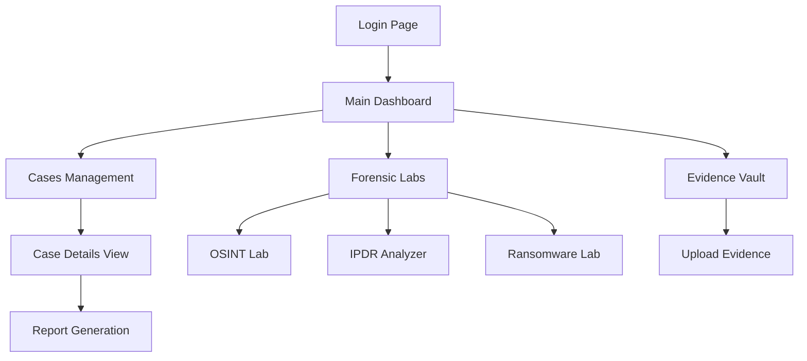
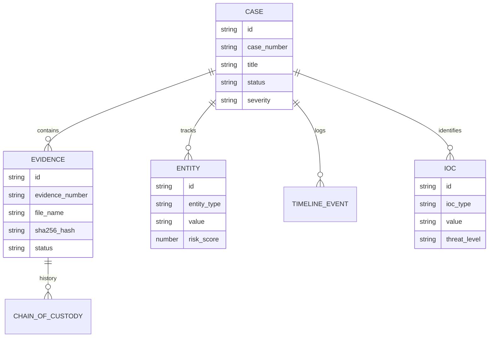

# AEGIS Digital Forensics Platform - Website Module Documentation

## 1. Module Overview
The **AEGIS Website Module** is a modern, responsive frontend application built for the AEGIS AI-Powered Digital Forensics Platform. It serves as the primary interface for digital forensic investigators, analysts, and supervisors to manage cases, analyze digital evidence, visualize threat data, and generate AI-assisted reports.

## 2. Module Architecture
The website is built using a modern React-based stack:
* **Framework:** Next.js 14 (using the modern App Router)
* **UI Library:** React 18
* **Styling:** Tailwind CSS (with `tailwind-merge` and `clsx` for dynamic class management)
* **State Management:** Zustand and standard React Hooks (`useState`, `useEffect`)
* **Visualization:** Chart.js, React-Leaflet, and Cytoscape for complex data and graph rendering
* **Icons:** Lucide React


## 3. Module Workflow
The general workflow within the website module is as follows:
1. **Authentication:** Users log in via the `page.tsx` login screen.
2. **Dashboard Overview:** Upon login, users are routed to the central Dashboard which displays active cases, telemetry, and high-level metrics.
3. **Investigation:** Users navigate via the `Sidebar` to specific domain labs:
   * **Cases:** Manage incident records and FIRs.
   * **Evidence Vault:** Upload and hash digital artifacts.
   * **Specialized Labs:** OSINT Lab, IPDR Analyzer, Ransomware Lab for specific forensic tasks.
4. **Analysis & Reporting:** Users review AI-generated insights, view MITRE ATT&CK matrices, and utilize the `ReportGenerator` to export findings.



## 4. Folder Structure
The codebase follows the Next.js App Router conventions, located under the `frontend` directory:

* `src/app/`: Contains the Next.js App Router pages and layouts.
  * `(dashboard)/`: Route group containing all authenticated views (Admin, Cases, IPDR, OSINT, Reports, Ransomware, Timeline, Evidence).
  * `page.tsx`: The root login page.
  * `layout.tsx`: Root layout defining the global HTML structure.
* `src/components/`: Reusable React components.
  * `analysis/`: Components for forensic analysis (e.g., `AISummary`, `BehavioralTimeline`, `MitreMatrix`, `ProcessTree`, `ReportGenerator`).
  * `layout/`: Global layout elements (`Sidebar`, `TopBar`).
  * `upload/`: `SecureUpload` component for handling evidence file drops.
* `src/data/`: Contains `mock-data.ts` to simulate API responses for the UI prototype.
* `src/lib/`: Utility functions (`utils.ts`) and business logic (`report-generator.ts`).
* `src/types/`: TypeScript interfaces for the data models (`index.ts`).
* `public/`: Static assets (e.g., `logo.jpg`).

## 5. Features
* **Dashboard Analytics:** High-level overview of active cases, threats detected, and pending analyses.
* **Cases Management:** Interface to view, filter, and register new FIRs (First Information Reports). Includes AI-assisted narrative analysis.
* **Evidence Vault:** Secure evidence upload interface with simulated real-time SHA-256/MD5 hashing.
* **OSINT Lab:** Open-source intelligence search interface simulating queries against domains, IPs, and emails.
* **IPDR Analyzer:** Call Detail Record visualization and location mapping using Leaflet.
* **Ransomware Lab:** Specific workspace for malware analysis, tracking variants, ransom amounts, and kill chains.
* **Timeline:** Chronological event tracking for cases.
* **Report Generation:** Client-side generation of HTML/PDF forensic reports.
* **Admin Panel:** Platform settings, version info, and user management placeholders.

## 6. User Interface Documentation
The UI is heavily styled with a "cyber" theme, utilizing dark modes, cyan/blue accents, and glassmorphism.

* **TopBar (`src/components/layout/TopBar.tsx`):** Displays current context, search bar, and notifications.
* **Sidebar (`src/components/layout/Sidebar.tsx`):** Collapsible navigation menu displaying the AEGIS logo and routing links to various labs.
* **Login (`src/app/page.tsx`):** Features a secure access portal with mock authentication logic.
* **Analysis Components:** 
  * `MitreMatrix.tsx`: Visualizes TTPs (Tactics, Techniques, and Procedures).
  * `ProcessTree.tsx`: Displays hierarchical process execution flows.

## 7. Backend Documentation
Currently, the website module operates largely as a frontend prototype. It relies on two mechanisms for data:
1. **Mock Data:** Extensive use of `src/data/mock-data.ts` to populate UI states.
2. **Next.js Rewrites:** The `next.config.js` is configured to proxy all `/api/*` requests to a backend service expected at `http://localhost:8000/api/`.

*Note: As of the current implementation, API calls (like `fetch('/api/v1/cases')` found in `cases/page.tsx`) rely on the external backend service being active.*

## 8. Database Documentation
While the frontend does not directly connect to a database, it strictly defines the expected relational models in `src/types/index.ts`. 



## 9. Data Flow
1. **User Action:** The user interacts with the UI (e.g., submits a new FIR in Cases).
2. **Client State:** React state (`useState`) temporarily holds the form data.
3. **API Request:** A `fetch` request is dispatched to `/api/v1/...`.
4. **Proxy:** Next.js intercepts the request and proxies it to `localhost:8000`.
5. **Response Handling:** The UI receives the JSON response, updates the React state, and triggers a re-render.

## 10. Security
The website module includes foundational security concepts:
* **Mock Authentication:** The `page.tsx` includes an email/password form simulating a secure gateway.
* **Role-Based Types:** `types/index.ts` defines `UserRole` (`admin`, `investigator`, `analyst`, `supervisor`), setting the stage for RBAC (Role-Based Access Control) in the UI components.

## 11. Report Generation
Implemented in `src/lib/report-generator.ts`, the platform can dynamically generate downloadable `.html` report files. 
* It accepts parameters like `reportName`, `confidenceScore`, and `findings`.
* It constructs an HTML document containing AEGIS branding, AI confidence scores, and dynamic tables based on the investigation's current state.
* The report is triggered client-side using `Blob` and URL object creation for direct browser downloads.

## 12. Integration with Main Project
The website module (`frontend`) integrates with the broader AEGIS project primarily over HTTP API boundaries. 
* **API Proxy:** Configured in `next.config.js` to point to port 8000.
* **Docker Support:** A `Dockerfile` exists within the `frontend` directory, indicating it is containerized and orchestrated alongside the backend (via `docker-compose.yml` in the project root).

## 13. Installation & Configuration
To run the website module locally:

1. **Navigate to the frontend directory:**
   ```bash
   cd frontend
   ```
2. **Install dependencies:**
   ```bash
   npm install
   ```
3. **Configure Environment Variables:**
   * Create or modify `.env.local` as needed.
4. **Run the Development Server:**
   ```bash
   npm run dev
   ```
5. **Access the application** at `http://localhost:3000`.

## 14. Testing
Currently, the module does not have a formal testing suite implemented (no Jest, React Testing Library, or Cypress configurations are present in `package.json`).

## 15. Future Enhancements
* **State Management Integration:** While `zustand` is installed, a centralized global store can be built to handle user sessions and active case contexts across all route groups.
* **Real API Binding:** Replace fallback logic and `mock-data.ts` dependencies with robust error handling for real API connections.
* **WebSocket Integration:** Implement real-time updates for Evidence Upload progress and OSINT stream ingestion.
* **Automated Testing:** Implement E2E and component testing.

## 16. Conclusion
The AEGIS website module is a heavily visualized, robustly typed React/Next.js frontend. It correctly implements the required routing, complex analytical components, and proxy configurations to seamlessly serve as the face of the AI-Powered Digital Forensics Platform.
